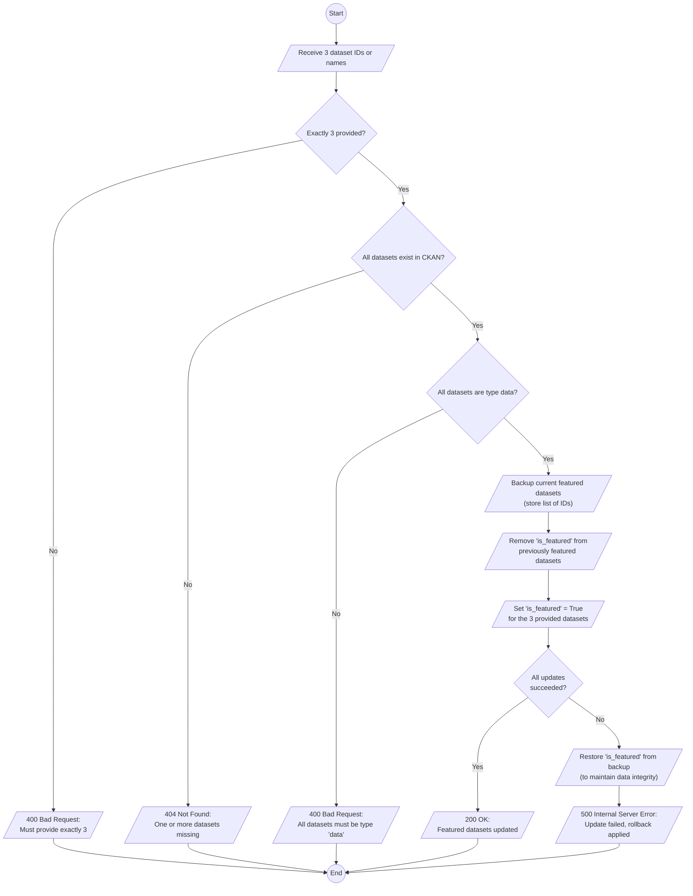
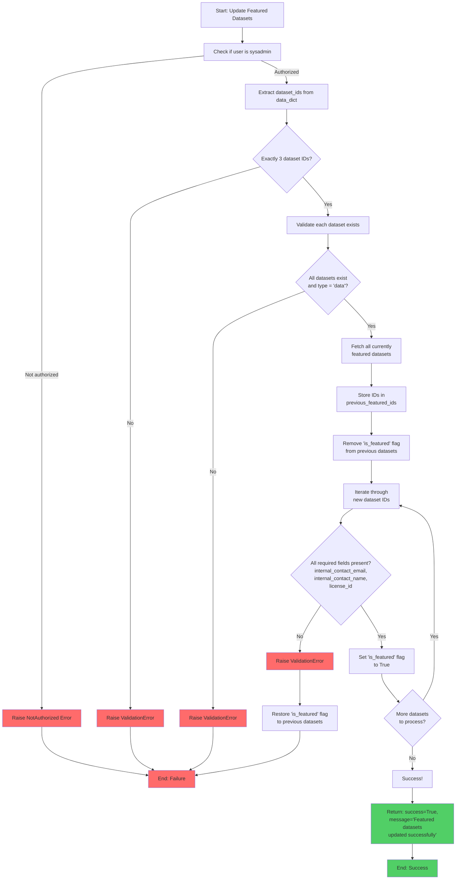

# API

## `package_set_featured`

Manage featured datasets.

This action ensures that exactly three datasets are marked as "featured" while
removing the "featured" status from previously featured datasets. The API
includes robust validation to ensure that only valid datasets of type `data`
can be featured.

---

### What It Does

1. **Sets Three Datasets as Featured**:
    - Marks exactly three datasets as "featured" by setting the `is_featured` flag to `True`.

2. **Removes Previous Featured Datasets**:
    - Removes the "featured" status from all previously featured datasets.

3. **Validates Input**:
    - Ensures that exactly three dataset IDs or names are provided.
    - Checks that all provided datasets exist in CKAN.
    - Ensures that all provided datasets are of type `data`.
4. **Error Handling**:
    - If the process fails, the API restores the "featured" status of previously featured datasets to maintain data integrity.





---

### How It Works

1. **Authorization Check**:
    - The API verifies that the user making the request is a sysadmin using the `is_user_sysadmin` function.
    - If the user is not a sysadmin, the API raises a `NotAuthorized` error.

2. **Input Validation**:
    - Extracts the `dataset_ids` from the `data_dict` parameter.
    - Ensures that exactly three dataset IDs are provided. If not, a `ValidationError` is raised.

3. **Dataset Validation**:
    - Uses the `package_show` action to check if each dataset exists.
    - Ensures that all datasets are of type `data`. If any dataset does not exist or is not of type `data`, a `ValidationError` is raised with a descriptive error message.

4. **Backup Current Featured Datasets**:
    - Fetches all currently featured datasets using the `package_search` action.
    - Stores their IDs in a list (`previous_featured_ids`) to allow restoration in case of failure.

5. **Remove "Featured" Status from Current Featured Datasets**:
    - Iterates through the `previous_featured_ids` and removes the "is_featured" flag from each dataset using the `package_update` action.

6. **Set "Featured" Status for New Datasets**:
    - Iterates through the provided dataset IDs.
    - Ensures all required fields (`internal_contact_email`, `internal_contact_name`, `license_id`) are present in the dataset.
    - Sets the "is_featured" flag to `True` for each dataset using the `package_update` action.

7. **Error Handling**:
    - If any error occurs during the process, the API restores the "is_featured" flag for the previously featured datasets to maintain consistency.
    - Raises a `ValidationError` with a descriptive error message if the process fails.

8. **Success Response**:
    - If the process completes successfully, the API returns a success message: `{"success": True, "message": "Featured datasets updated successfully."}`




---

### Requirements

1. **Sysadmin Privileges**:
   - Only users with sysadmin privileges can use this API. The `is_user_sysadmin` function checks the user's role.

2. **Valid Input**:
   - The `data_dict` parameter must include a key `dataset_ids` with exactly three dataset IDs or names. Example:
     ```json
     {
         "dataset_ids": ["dataset_id_1", "dataset_id_2", "dataset_id_3"]
     }
     ```

3. **Dataset Existence**:
   - All provided datasets must exist in CKAN. If any dataset does not exist, the API will raise a `ValidationError`.

4. **Dataset Type**:
   - All provided datasets must be of type `data`. If any dataset is not of type `data`, the API will raise a `ValidationError`.

5. **Required Fields in Datasets**:
   - The datasets being updated must include the following fields:
     - `internal_contact_email`
     - `internal_contact_name`
     - `license_id`
   - If any of these fields are missing, the API assigns default values:
     - `internal_contact_email`: `''` (empty string)
     - `internal_contact_name`: `''` (empty string)
     - `license_id`: `'notspecified'`

6. **CKAN Actions**:
   - The API relies on the following CKAN actions:
     - `package_show`: To fetch dataset details.
     - `package_search`: To fetch currently featured datasets.
     - `package_update`: To update dataset details.

7. **Error Handling**:
   - If the process fails, the API restores the "is_featured" flag for previously featured datasets to maintain consistency.

---

### Example Usage

**API Call Using `curl`:**
```bash
curl -X POST http://localhost:5000/api/3/action/package_set_featured \
    -H "Authorization: YOUR_SYSADMIN_API_KEY" \
    -H "Content-Type: application/json" \
    -d '{
        "dataset_ids": ["dataset_id_1", "dataset_id_2", "dataset_id_3"]
    }'
```
